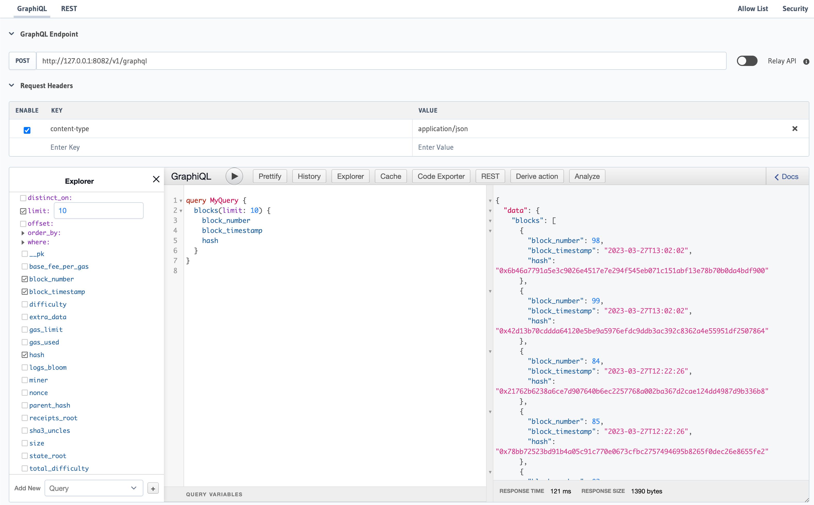

[](https://github.com/chainbase-labs/manuscript-core/releases)

[](https://docs.chainbase.com/core-concepts/manuscript/overview#core-values-and-capabilities-of-manuscript)
<a href="https://codecov.io/gh/kool-dev/kool"></a>
[](https://github.com)
[](https://goreportcard.com)\
[](https://app.fossa.com/projects/git%2Bgithub.com%2Fkubescape%2Fkubescape?ref=badge_shield&issueType=license)
[](https://x.com/chainbaseHQ)
[](https://join.slack.com/share/enQtNzc4NDI3Mzk2Njg3MS1hZjdhOGY0ZTU5ODk3ZmY0NDAzN2JiY2YxMjNmOTY5NmEwNWNhMDhiMWE0M2I1ZDc2YzI1NDQ3ZDhhMWQ4Zjg0?cdn_fallback=1)
[](https://discord.gg/YnAavwwR)
[](https://te.me/ChainbaseNetwork)

# Build The World's Largest Omnichain Data Network
Chainbase is a global blockchain data network with an extensive dataset and cluster worldwide. If we compare Chainbase’s global data network to a country, then Manuscript would be the language of this data network nation. Manuscript plays a crucial role in the Chainbase ecosystem, serving as a bridge connecting various data, services, and users.
### what is manuscript?

Manuscript is not just a language specification; it’s a protocol, framework, and toolkit designed to simplify and unify data access and processing methods. Through Manuscript, developers and users can more easily interact with the vast amount of data in the Chainbase network, whether querying, analyzing, or applying this data.
The vision of Manuscript is to realize “data trade” within the Chainbase network, establishing a Chainbase ecosystem component that allows users to access any data through any means, across any service, using any language. This grand vision can be broken down into the following key aspects:

- Any language: We hope users can use scripts in any mainstream programming language to customize data, including but not limited to: Golang, Rust, Python, Node.js, Java, C/C++, Zig, WebAssembly (WASM)
- Any method: Different users are familiar with different forms of data access, we hope users can access data through various means, including but not limited to: SQL, DataFrames, HTTPS, gRPC, FTP, WebDAV, FUSE
- Any data: Users should be able to access data in any format, such as: JSON, CSV, ORC, XML, XLSX, BLOB
- Across any service: Users’ expected data storage services also vary, we hope users can access, transfer, and control data in any service, such as: RPC, S3, IPFS, Azblob, HDFS, Google Drive, BigQuery, WebDAV, MySQL, PostgreSQL
### Value of Manuscript
- **Programmability**: Manuscript provides powerful programmable interfaces that allow developers to customize data processing workflows according to their needs. This flexibility means that Manuscript can be used not only for simple data queries but also for building complex data analysis pipelines and applications. Through programmability, Manuscript opens up infinite possibilities for innovative applications of blockchain data.

- **Interoperability**: With the booming development of blockchain technology, it’s becoming increasingly difficult for different blockchains to understand and process each other’s data. Manuscript can solve the interoperability problem of multi-chain and off-chain data aggregation in any dimension. By providing unified interfaces and data processing methods, Manuscript enables seamless integration of data from different blockchains, greatly improving the development efficiency and feasibility of cross-chain applications.

- **Monetization**: Leveraging the data capabilities provided by Manuscript, combined with the dual-chain architecture CometBFT + DPoS high-performance instant transaction finality and proof-of-stake consensus features, Chainbase offers a fair and transparent data value exchange ecosystem. Creators can monetize their processed data through Manuscript, while data users can conveniently consume the data they need. This mechanism not only incentivizes the production of high-quality data but also promotes the positive development of the entire blockchain ecosystem.

## Getting Started 🏄
### Install Manuscript Client
```shell
# For macOs
curl -fsSL  https://github.com/Liquidwe/rust-examples/raw/main/install.sh | bash
```
### Requirements
[Docker Desktop 25.1+](https://www.docker.com/products/docker-desktop/)

### Example

Here's an example of how to <b>process</b> data from chainbase with manuscript:

1. After installing `manuscript-cli`, you can initialize the Manuscript scripts and environment using the command
```bash
➜  manuscript-cli --help
Chainbase Manuscript ™ Build The World\'s Largest Omnichain Data Network 🚀 🚀 🚀
─────────────────────────────────────────────────────────────────────────────────
Usage:
  manuscript-cli [command]

Available Commands:
  deploy      Deploy manuscript to flink cluster
  help        Help about any command
  init        Initialize and start Flink containers
  job         Initialize and start Flink containers

Flags:
  -h, --help   help for manuscript-cli

Use "manuscript-cli [command] --help" for more information about a command.
```
2. Use the client to initialize the `manuscript.yaml` file for a local standalone container environment
```bash
➜  manuscript-cli init
🏂 1. Enter your manuscript name: (default is demo)
7...
6: Polygon_zkEVM (Database: zkevm)
5: Avalanche (Database: avalanche)
4: Base (Database: base)
3: Arbitrum_One (Database: arb1)
2: Bsc (Database: bsc)
1: Ethereum (Database: ethereum)
🏂 1.Enter your chain choice (default is zkevm):

🧲 3.Please select a table from the list below:
1: blocks
2: transactionLogs
3: transactions
Enter your choice (default is blocks):
✔ No input provided. Defaulting to table: blocks

📍 3.Please select a data output target:
1: Postgresql
2: Print (output to console)
Enter your choice (default is Postgresql):
✔ No input provided. Defaulting to output target: postgres

🏄🏄 Summary of your selections:
Selected manuscript name: demo
Selected chain: zkevm
Selected table: blocks
Data output target: postgres

🚀 Do you want to proceed with the above selections? (yes/no): yes
···
✓ Step 5: Start Docker Containers completed successfully!
⠙ Step 6: Check Container Status Loading... ✓ Container demo is running
✓ Step 6: Check Container Status completed successfully!
🎉 Manuscript demo deployment completed successfully!
You can now list your job with the command:
👉 manuscript-cli job list

If you need to manually edit the manuscript, you can edit the file 'manuscript/demo/manuscript.yaml' and then manually execute the 'run' command:
👉 manuscript-cli run manuscript/demo/manuscript.yaml

You can now access your manuscript at http://localhost:8081
```
3. List the job to check the status of the job
```bash
manuscript-cli job list
🟢 1: Name: demo | State: RUNNING | Start Time: 2024-10-08 14:26 | Duration: 3 minutes | GraphQL: http://127.0.0.1:8082

manuscript-cli job log demo
···logs···
```
4. Access the GraphQL endpoint to query the data(GraphQL: http://127.0.0.1:8082)


### Key Concepts
There are two primary objects:
- `manuscript.yaml` - A script file used to describe the data processing workflow, defining data sources, data processing methods, and the final data flow direction.
- `docker-compose.yaml` - The Docker Compose file defines a local container cluster environment, allowing developers to test locally. After testing, it can be deployed to the Chainbase distributed network.

Under the hood, the `Manuscript` will:
- Start a default stream processing framework, such as a Flink cluster.
- Consume user-defined source data.
- Process these stream data using your defined transforms.
- Sink the processed data to the data source.

## Roadmap 📍

Here are some of the planned improvements:

- [x] Support Chainbase Network Streaming Lakehouse.
- [x] Support Flink application mode.
- [x] Support Schema Registry.
- [ ] Support for user-defined functions (UDFs) for blockchain data parsing, such as decoding contract events and functions
- [ ] Support custom advanced data processing logic with JAVA and Rust APIs.
- [ ] Support local lightweight k8s environment deployment.
- [ ] Support distributed edge node coordinators.
- [ ] Support RPC and substream data processing formats.
- [ ] Support light node authentication.

## Contributors

<!-- readme: contributors -start -->
<!-- readme: contributors -end -->

## Get Involved 🤝

- Please use [GitHub issues](https://github.com/chainbase-labs/manuscript-core/issues) to report bugs and suggest new features.
- Join the [Manuscript Community On Telegram](https://te.me/ChainbaseNetwork), a vibrant group of developers, data engineers and newcomers to blockchain data, who are learning and leveraging Manuscript for real-time data processing.
- Follow us on [X](https://x.com/chainbaseHQ) where we share our latest tutorials, forthcoming community events and the occasional meme.
- If you have any questions or feedback - write to us at support@chainbase.com!

## License 📗

Manuscript-core is licensed under the Apache 2.0 license.  
View a copy of the License file [here](https://github.com/chainbase-labs/manuscript-core/blob/main/LICENSE).
