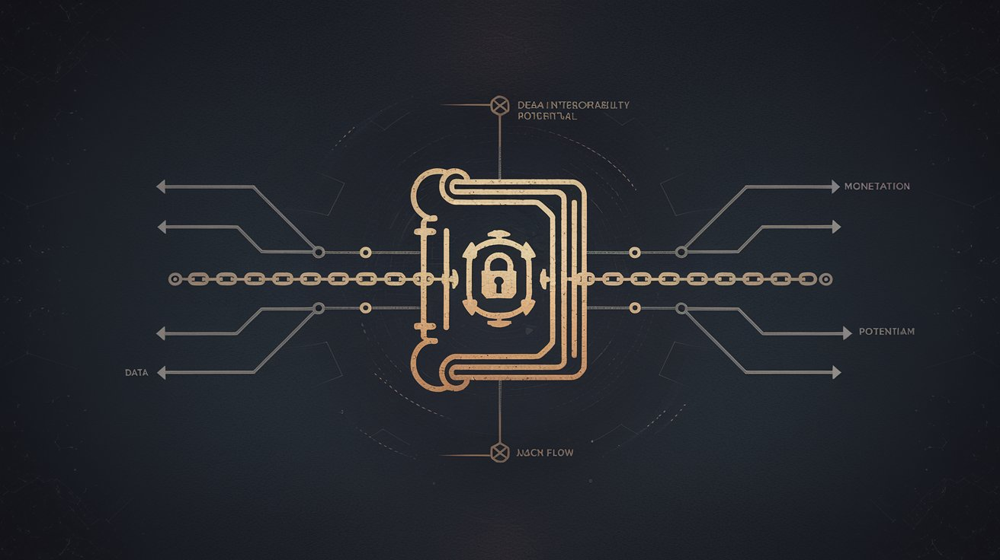
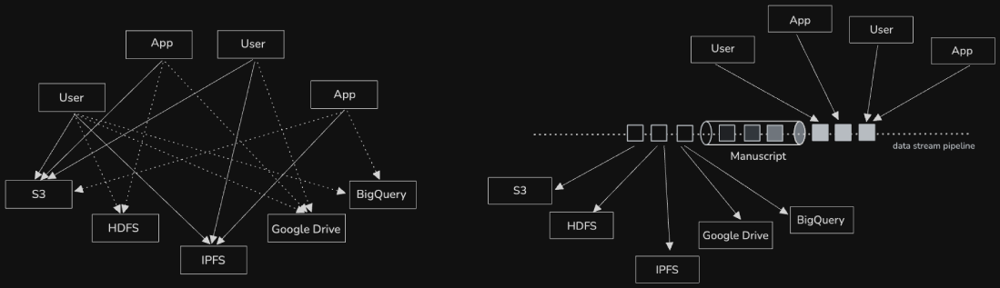
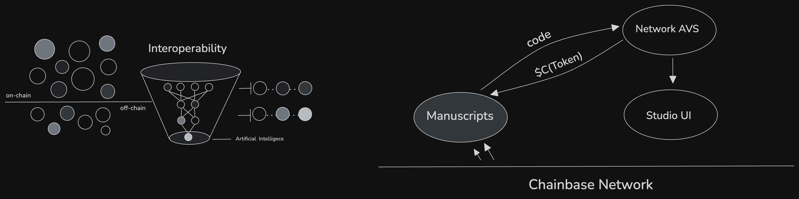
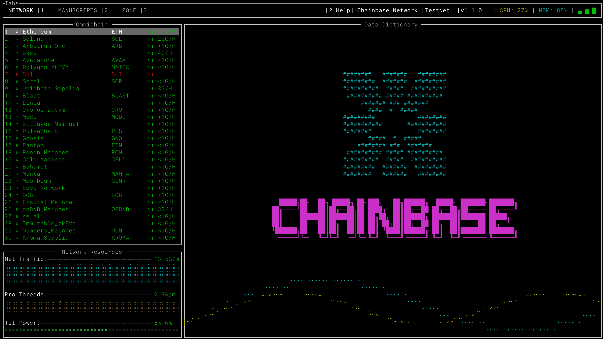
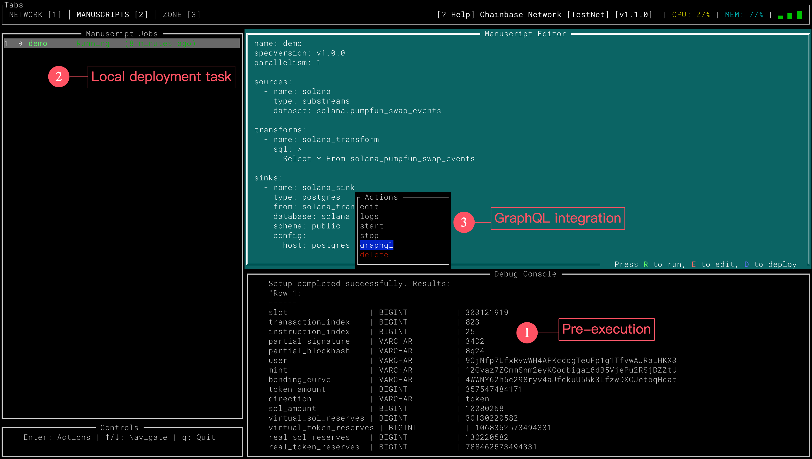
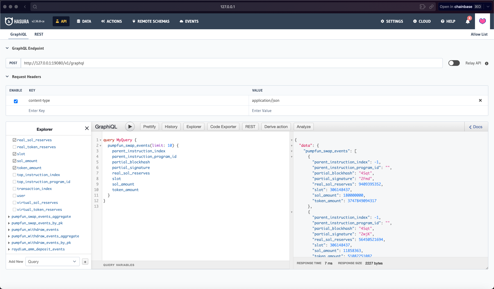

<div>
<a href="https://chainbase.com/blockchains">
    
</a>


[](https://github.com/chainbase-labs/manuscript-core/releases)

[](https://docs.chainbase.com/core-concepts/manuscript/overview#core-values-and-capabilities-of-manuscript)
[](https://discord.com/channels/933995010158907422/935156893872185344)
[](https://t.me/ChainbaseNetwork)
<a href="https://x.com/chainbasehq" target="_blank" style="display: flex; align-items: center;">

</a>
# Build The World's Largest Omnichain Data Network
Chainbase is a global blockchain data network with an extensive dataset and cluster worldwide. If we compare Chainbase’s global data network to a country, then Manuscript would be the language of this data network nation. Manuscript plays a crucial role in the Chainbase ecosystem, serving as a bridge connecting various data, services, and users.
### what is manuscript?
<div style="display: flex; align-items: center;">

</div>
</div>

Manuscript is not just a language specification; it’s a protocol, framework, and toolkit designed to simplify and unify data access and processing methods. Through Manuscript, developers and users can more easily interact with the vast amount of data in the Chainbase network, whether querying, analyzing, or applying this data.
The vision of Manuscript is to realize “data trade” within the Chainbase network, establishing a Chainbase ecosystem component that allows users to access any data through any means, across any service, using any language. This grand vision can be broken down into the following key aspects:

- Any language: We hope users can use scripts in any mainstream programming language to customize data, including but not limited to: Golang, Rust, Python, Node.js, Java, C/C++, Zig, WebAssembly (WASM)
- Any method: Different users are familiar with different forms of data access, we hope users can access data through various means, including but not limited to: SQL, DataFrames, HTTPS, gRPC, FTP, WebDAV, FUSE
- Any data: Users should be able to access data in any format, such as: JSON, CSV, ORC, XML, XLSX, BLOB
- Across any service: Users’ expected data storage services also vary, we hope users can access, transfer, and control data in any service, such as: RPC, S3, IPFS, Azblob, HDFS, Google Drive, BigQuery, WebDAV, MySQL, PostgreSQL
### Value of Manuscript
<a style="display: flex; align-items: center;">

</a>

- **Programmability**: Manuscript provides powerful programmable interfaces that allow developers to customize data processing workflows according to their needs. This flexibility means that Manuscript can be used not only for simple data queries but also for building complex data analysis pipelines and applications. Through programmability, Manuscript opens up infinite possibilities for innovative applications of blockchain data.

- **Interoperability**: With the booming development of blockchain technology, it’s becoming increasingly difficult for different blockchains to understand and process each other’s data. Manuscript can solve the interoperability problem of multi-chain and off-chain data aggregation in any dimension. By providing unified interfaces and data processing methods, Manuscript enables seamless integration of data from different blockchains, greatly improving the development efficiency and feasibility of cross-chain applications.

- **Monetization**: Leveraging the data capabilities provided by Manuscript, combined with the dual-chain architecture CometBFT + DPoS high-performance instant transaction finality and proof-of-stake consensus features, Chainbase offers a fair and transparent data value exchange ecosystem. Creators can monetize their processed data through Manuscript, while data users can conveniently consume the data they need. This mechanism not only incentivizes the production of high-quality data but also promotes the positive development of the entire blockchain ecosystem.

## ✨ Videos

## Getting Started 🏄
### Install Manuscript Client
You may choose to run any client or compile from the source code:
##### GUI
```shell
curl -fsSL  https://github.com/chainbase-labs/manuscript-core/raw/main/install-gui.sh | bash
```
#### CLI
```shell
curl -fsSL  https://github.com/chainbase-labs/manuscript-core/raw/main/install.sh | bash
```
#### MAKE
```shell
➜  manuscript-core git:(main) ✗ make
Available targets:
  🔧 all           - Build both CLI and GUI
  🐹 cli           - Build only the CLI
  🦀 gui           - Build only the GUI
  🧹 clean         - Clean build artifacts
  🧪 test          - Run tests for both projects
  📦 install       - Install both binaries to /usr/local/bin
  📦 install-cli   - Install only the CLI binary to /usr/local/bin
  📦 install-gui   - Install only the GUI binary to /usr/local/bin
```

### GUI


### Requirements
[Docker Desktop 25.1+](https://www.docker.com/products/docker-desktop/)

### Example

Here's an example of how to <b>process</b> data from chainbase with manuscript:

#### 1. Selecting data and creating local tasks



#### 2. Waiting for the task to run and use the data



😆😆 data has never been so simple...

### Key Concepts
Default location for the Manuscript configuration file:   `~/.manuscript_config.ini`  
For local setups, data storage directory:  `~/manuscripts/<name>`  

There are two primary objects:
- `manuscript.yaml` - A script file used to describe the data processing workflow, defining data sources, data processing methods, and the final data flow direction.
- `docker-compose.yaml` - The Docker Compose file defines a local container cluster environment, allowing developers to test locally. After testing, it can be deployed to the Chainbase distributed network.

Under the hood, the `Manuscript` will:
- Start a default stream processing framework, such as a Flink cluster.
- Consume user-defined source data.
- Process these stream data using your defined transforms.
- Sink the processed data to the data source.

## Roadmap 📍

Here are some of the planned improvements:

- [x] Support Chainbase Network Streaming Lakehouse.
- [x] Support Flink application mode.
- [x] Support Schema Registry.
- [ ] Support for user-defined functions (UDFs) for blockchain data parsing, such as decoding contract events and functions
- [ ] Support custom advanced data processing logic with JAVA and Rust APIs.
- [ ] Support local lightweight k8s environment deployment.
- [ ] Support distributed edge node coordinators.
- [ ] Support RPC and substream data processing formats.
- [ ] Support light node authentication.

## Contributors

<!-- readme: contributors -start -->
<table>
	<tbody>
		<tr>
            <td align="center">
                <a href="https://github.com/Liquidwe">
                    
                    <br />
                    <sub><b>Liquid</b></sub>
                </a>
            </td>
            <td align="center">
                <a href="https://github.com/lxcong">
                    
                    <br />
                    <sub><b>lxcong</b></sub>
                </a>
            </td>
            <td align="center">
                <a href="https://github.com/XdpCs">
                    
                    <br />
                    <sub><b>Alan Xu</b></sub>
                </a>
            </td>
            <td align="center">
                <a href="https://github.com/fishTsai20">
                    
                    <br />
                    <sub><b>fishTsai20</b></sub>
                </a>
            </td>
            <td align="center">
                <a href="https://github.com/KagemniKarimu">
                    
                    <br />
                    <sub><b>KagemniKarimu</b></sub>
                </a>
            </td>
            <td align="center">
                <a href="https://github.com/ypszn">
                    
                    <br />
                    <sub><b>ypszn</b></sub>
                </a>
            </td>
		</tr>
		<tr>
            <td align="center">
                <a href="https://github.com/AlanViast">
                    
                    <br />
                    <sub><b>Alan Viast</b></sub>
                </a>
            </td>
            <td align="center">
                <a href="https://github.com/nnsW3">
                    
                    <br />
                    <sub><b>Elias Rad</b></sub>
                </a>
            </td>
            <td align="center">
                <a href="https://github.com/jinmu0410">
                    
                    <br />
                    <sub><b>jinmu0410</b></sub>
                </a>
            </td>
            <td align="center">
                <a href="https://github.com/junyoungcross">
                    
                    <br />
                    <sub><b>김준영</b></sub>
                </a>
            </td>
		</tr>
	<tbody>
</table>
<!-- readme: contributors -end -->

## Get Involved 🤝

- Please use [GitHub issues](https://github.com/chainbase-labs/manuscript-core/issues) to report bugs and suggest new features.
- Join the [Manuscript Community On Telegram](https://t.me/ChainbaseNetwork), a vibrant group of developers, data engineers and newcomers to blockchain data, who are learning and leveraging Manuscript for real-time data processing.
- Follow us on [X](https://x.com/chainbaseHQ) where we share our latest tutorials, forthcoming community events and the occasional meme.
- If you have any questions or feedback - write to us at support@chainbase.com!

<table>
	<tbody>
		<tr>
            <td align="center">
                <a href="https://discord.gg/chainbase">
                    
                    <br />
                </a>
            </td>
            <td align="center">
                <a href="https://t.me/ChainbaseNetwork">
                    
                    <br />
                </a>
            </td>
		</tr>
	<tbody>
</table>

## License 📗

Manuscript-core is licensed under the Apache 2.0 license.  
View a copy of the License file [here](https://github.com/chainbase-labs/manuscript-core/blob/main/LICENSE).
